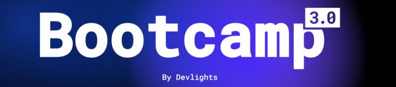

# Proyecto Final - API

> [Volver al README principal](../README.md)

## Aplicación eCommerce para venta de productos de música sin pasarela de pagos

> Objetivo: Construir una API que sirva de backend para la aplicación frontend

### Requerimientos Base:

1. Creación de modelos o entidades a utilizar:
   - Producto
   - Usuario
   - Compra
1. Armado de arquitectura básica:
   - config
   - routes
   - models
   - database
1. Autenticación:
   - Añadir Login - Objetivo: Autenticación de usuario
   - Añadir Registro de Usuario - Objetivo: Crear una cuenta de usuario
1. Lista de Productos Disponibles - Objetivo: Permitir a los compradores acceder
   a una lista de productos disponibles
   - Añadir Paginado
   - Añadir Filtro
   - Añadir Búsqueda
   - Añadir Ordenamiento
   - Lista de Productos por Vendedor - Objetivo: Permitir acceder a lista de productos
     de un vendedor
1. Visualización de Producto - Objetivo: Permitir a los compradores acceder a más
   datos o detalles de un producto disponible
1. Ver Datos de Vendedor - Objetivo: Obtener datos del vendedor
1. Añadir producto a carrito de compras - Objetivo: Permitir al comprador poder
   agregar uno o más productos a carrito de compra

### Requerimientos Usuario Comprador:

1. Compra de Productos - Objetivo: Permitir a los compradores comprar productos del
   carrito.
   - Simulación de Pagos - Objetivo: Simular el proceso de pago al comprar un producto
1. Historial de Compras - Objetivo: Permitir a los compradores ver su historial de
   compras.
1. Edición de Perfil Comprador: Objetivo: Permitir a los compradores editar su perfil
   y cargar una imagen.
